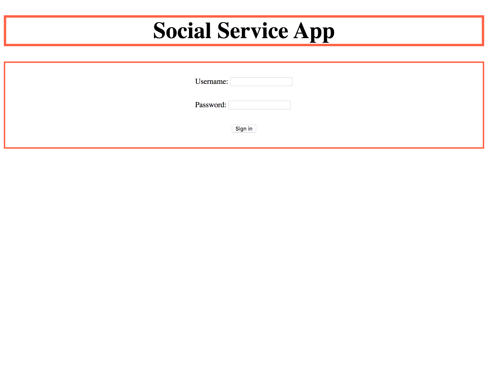
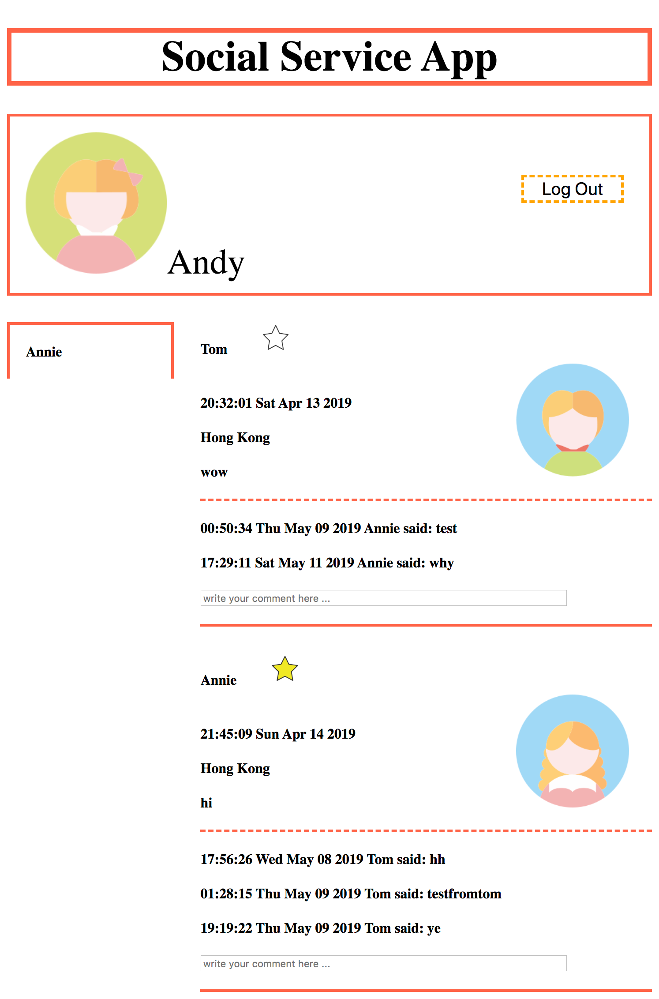
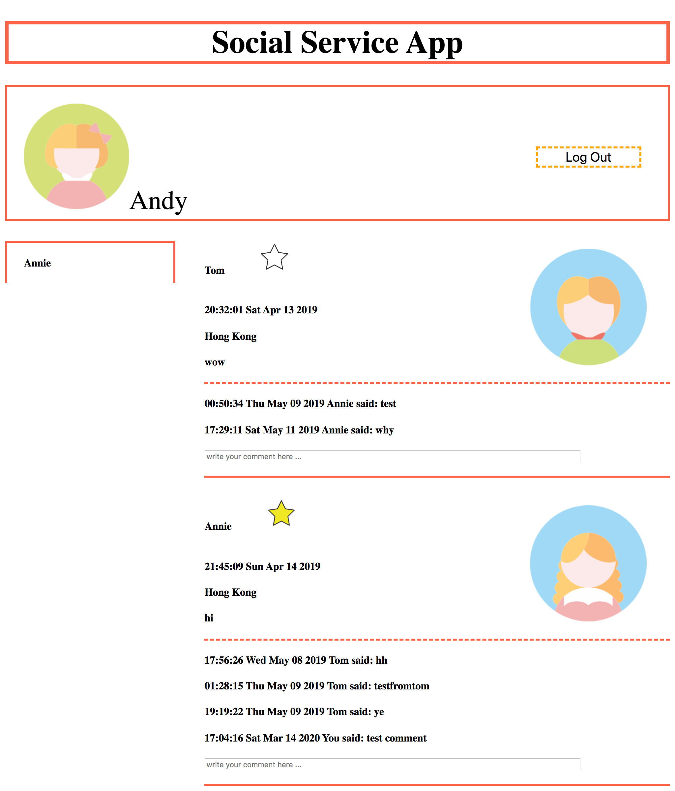
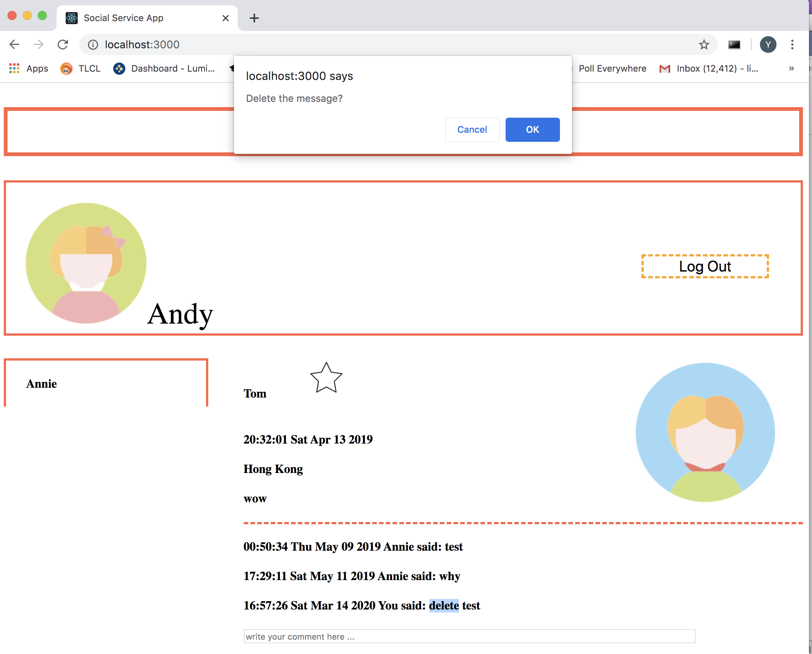
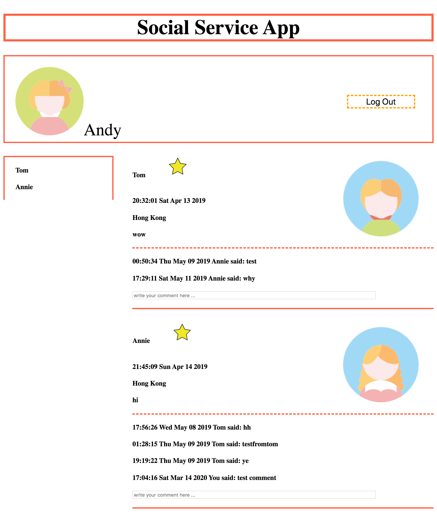
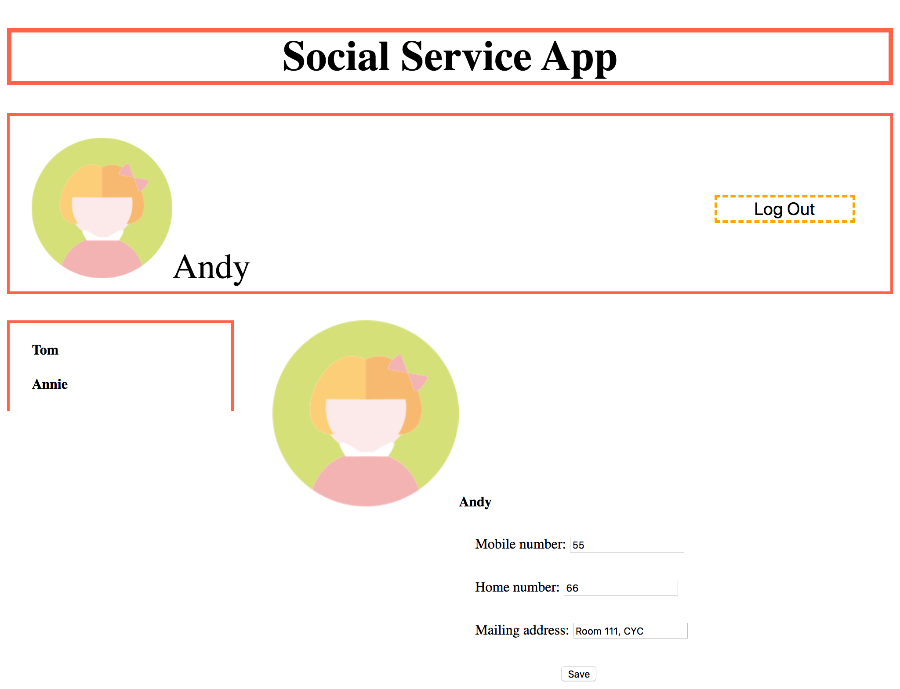

# Introduction of the app
* Upon loading, the page will show

* After a user (e.g., Andy) has logged in, the page will show. Names of a list of starred friends are shown on the left, and the posts by all friends and associated comments are displayed on the right. 

* After you have entered a comment in a comment input textbox (e.g., in the second textbox in page) and pressed enter, the comment is displayed above the textbox.

* On a page view as in Fig. 3, when you double click a comment you have posted, e.g., on the line shown “Time You said: xxx”, a popup box will be shown, asking you to confirm deletion of the post or not (Fig. 4). If you confirm deletion by clicking “OK” button, the comment is deleted; otherwise, if
you click “Cancel”, the page view remains as above.

* Within the posts division on the right, there is a star icon following the name of the friend in each post. There are two versions of the star icon: one to display when the friend is not starred (e.g., the star icon following the first name in page), and one to display when the friend is starred (e.g., the star icon following the second name in page). When you click on a star icon, it will be switching between the two versions, indicating switching between starred and un-starred states of the respective friend. For example, after you click the first start icon on the above page, the page view becomes one in the following page. The list on the left shows the names of starred friends, and should be updated accordingly. 

* After you click the area containing Andy’s icon and name at the top of the page, a profile update page is shown on the right. Mobile number, home number and address of the current user are displayed in the three input textboxes. You can edit the information and then after you click the “Save” button, the page view goes back
to one as following, and the information of the current user is updated to the server side. 

* The web page will periodically retrieve new comments and comment deletions from friends on the displayed posts from the backend web service, and update the page display accordingly.

* When you click the “log out” button, the page view goes back to login page.

# How to use

## install MongoDB

* Step 1: `git clone https://github.com/linyaya/soicalNetworkApp.git`

* Step 2: Go to https://www.mongodb.com/download-center/community and download the
latest version of MongoDB (choose the latest “Community Server” release to download). Install MongoDB to a directory at your choice.

* Step 3: Launch the 2nd terminal (besides the one you use for running NPM commands), and
switch to the directory where MongoDB is installed. Start MongoDB server using the “data”
directory of “MyApp” project as the database location, as follows: (replace “YourPath” by the
actual path on your computer that leads to “MyApp” directory)
If you use a 64-bit MongoDB on your own computer, please use the following command：
`./bin/mongod --dbpath YourPath/SocialService/data`

## edit db
start server`./bin/mongo`
`use assignment2`
`show collections`
there are three tables
e.g
`db.userList.insert({'name': 'Andy', 'password': '123456', 'icon': 'icons/andy.jpg', 'mobileNumber': '55555555', 'homeNumber': '66666666', 'address': 'Room 111, CYC', 'friends':[{'friendId': 'xxx', 'starredOrNot': 'N'}, {'friendId': 'xxx', 'starredOrNot': 'Y'}], 'lastCommentRetrievalTime':'22:00:12 Sat Apr 13 2019'})`
`db.postList.insert({'userId': 'xxx', 'time': '20:32:01 Sat Apr 13 2019', 'location': 'Hong Kong', 'content': 'post content'})`
`db.commentList.insert({'postId': 'xxx', 'userId': 'xxx', 'postTime': '21:00:11 Sat Apr 13 2019', 'comment': 'comment content', 'deleteTime': ''})`

* For implementation simplicity, in this assignment, we do not store icon images in MongoDB. Instead, we store them in the hard disk under the MyApp/public/icons/ folder, and store the path of an icon in the userList collection only, using which we can identify the icon image in the icons folder.

## start backend server

`cd YourPath/SocialService`
`npm install`
`node app.js`

## start front end
`cd YourPath/MyApp`
`npm install`
`npm start`

# Implementaion notes

## Overview

* This application uses the MERN stack (MongoDB, Express.JS, ReactJS, and Node.js)

* MyApp is for front end and start at 3000, send request to 3001.

* SocialService is for back end and listen at 3001 port.

* user data stores in SocialService/data.

## Some key points of the design
* When load the page, send a request "http://localhost:3001/signin" to try to login,
if the cookie is set, it will automatically login, otherwise show the login page

* 'Login failure' will appear when username doesn't match password, or either userName or password
is empty. If both them are empty (like load the page at the first time), it won't appear.
But if the 'Login failure' has already shown, empty the input box won't let it disappear,
that's to say, won't change the wrong status.

* On request "http://localhost:3001/signin", server will pass such an data to client:
{'name':userName,
'icon':userIcon,
'friendsBlocks':all information about friends}
friendsBlocks is an array, each element contains:
{'friendId':friendId,
'friendName':friendName,
'friendIcon':friendIcon,
'starredOrNot':star status,
'time':time,
'location':location,
'postId':postId,
'content': post content,
'commentList': commentList}
commentList is also an array, each element contains:
{'postId': postId,
'commentId': id of this comment,
'userId': id of user,
'userName':name of user,
'comment': comment content,
'postTime': post time,
'deleteTime': delete time}

* Request "http://localhost:3001/loadcommentupdates" will be sent in three cases,
one is automatically send every 10 seconds, the second is when adding comment,
and the third is when deleting comment.
This request will return an commentList array, if the comment should be update on the current page
(post time or delete time is later than lastCommentRetrievalTime), the element would be
{'postId': postId,
'commentId': id of this comment,
'userId': id of user,
'userName':name of user,
'comment': comment content,
'postTime': post time,
'deleteTime': delete time}
if no need to update, it should be null.

* When page width is less than 580px, it will change the display.

* I have added a new module 'async' in express

